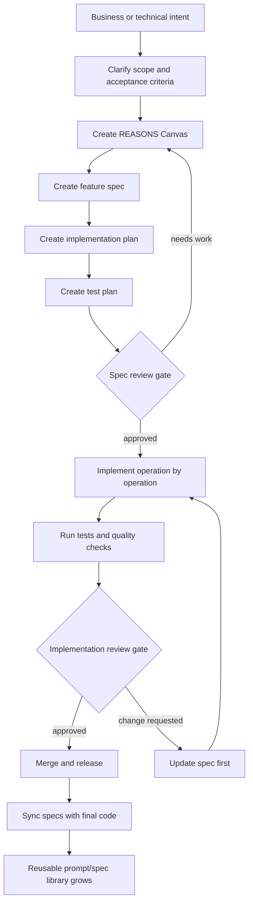
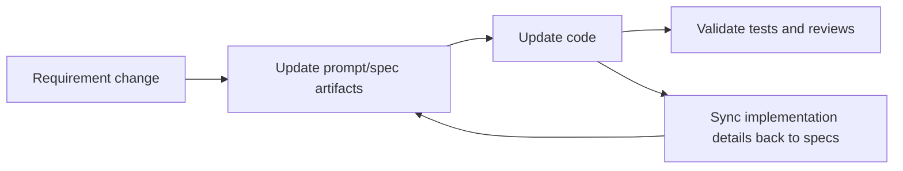
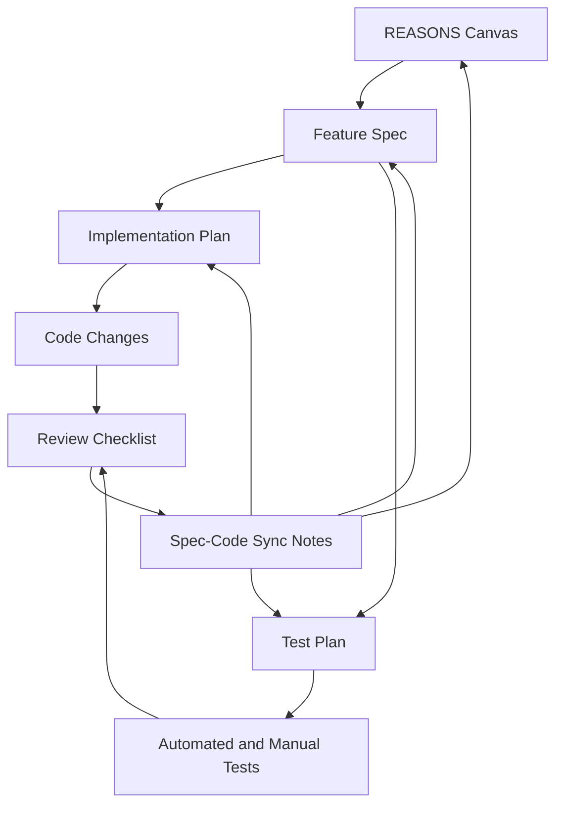
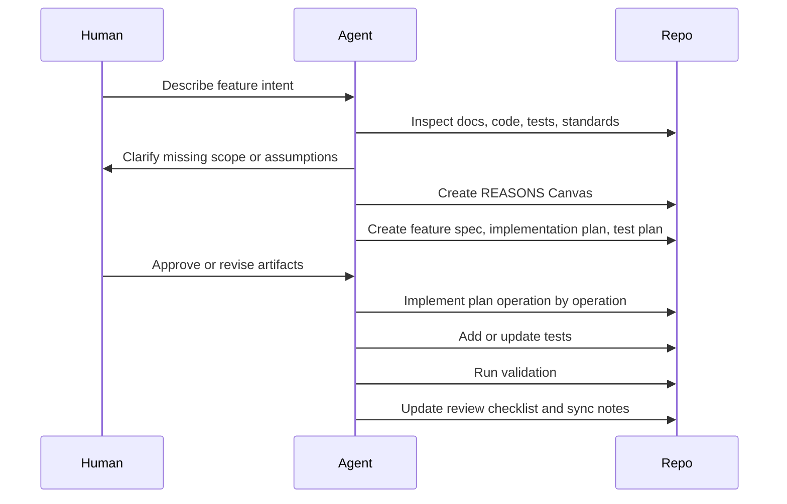
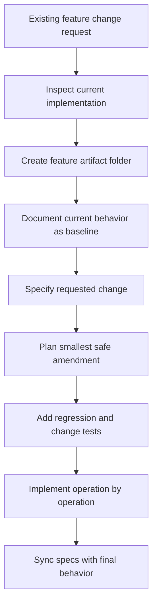

# AI Delivery Standards

Reusable standards, prompts, specifications, and workflows for AI-assisted software delivery.

This repository is an AI operating system for software teams. It standardizes how agents such as Codex, Claude Code, Cursor, Windsurf, and other coding assistants move from product intent to implementation without skipping the thinking that keeps systems coherent.

The framework is inspired by Structured-Prompt-Driven Development (SPDD) and the REASONS Canvas described by Thoughtworks on Martin Fowler's site: <https://martinfowler.com/articles/structured-prompt-driven/>. This repository adapts those ideas into a reusable engineering standards framework that can be copied into greenfield projects, layered into existing products, or used centrally across many teams.

## What This Repository Provides

| Area | What It Standardizes | Where |
| --- | --- | --- |
| Agent behavior | How AI agents clarify, specify, implement, review, and sync changes | `agents/` |
| Prompt artifacts | Reusable templates for REASONS Canvas, specs, plans, tests, and reviews | `templates/` |
| Engineering quality | Code, architecture, frontend, backend, security, accessibility, observability, testing | `standards/` |
| Delivery process | New project, feature queues, feature, bug fix, refactor, reviews, release process | `workflows/` |
| Worked example | End-to-end feature artifacts for a scoped in-app help assistant | `examples/` |
| Bootstrap CLI | Project scaffolding, feature artifact creation, standards sync, setup checks | `bin/ai-delivery.js` |

## Core Rule

No implementation starts before specification.

Every meaningful feature must have these artifacts committed with the code:

1. REASONS Canvas
2. Feature spec
3. Implementation plan
4. Test plan
5. Review checklist

When one request contains multiple independent features, maintain `docs/features/feature-queue.md` from `templates/feature-queue.md` and use `workflows/autonomous-feature-queue.md` to continue through the queue until every item is complete or blocked.

For defects, use `templates/bugfix-spec.md`. For design decisions with long-term consequences, add `templates/architecture-decision-record.md`.

## Repository Structure

```text
ai-delivery-standards/
  README.md
  package.json
  bin/
    ai-delivery.js
  agents/
  templates/
  standards/
  workflows/
  examples/
```

## SPDD Concepts Implemented Here

| SPDD Concept | Repository Mechanism |
| --- | --- |
| Prompts as first-class artifacts | Feature folders contain versioned REASONS Canvas, specs, plans, and checklists. |
| Intent before code | Workflows and agents require spec artifacts before non-trivial implementation. |
| REASONS Canvas | `templates/reasons-canvas.md` covers requirements, entities, approach, structure, operations, norms, and safeguards. |
| Operations-driven execution | `implementation-plan.md` converts design intent into ordered, testable operations. |
| Norms and safeguards | `standards/` defines reusable engineering rules and non-negotiable boundaries. |
| Prompt update | Requirement changes update specs first, then code. |
| Spec-code sync | `workflows/spec-sync.md` updates artifacts when implementation changes. |
| Autonomous queue execution | `workflows/autonomous-feature-queue.md` lets agents complete multi-feature requests without hand-holding while preserving stop conditions. |
| Iterative review | `workflows/ai-code-review.md` and `templates/review-checklist.md` review intent, code, tests, self-review, critic review, and sync. |

The team skills this framework encourages are abstraction first, alignment, and iterative review: think clearly about the model of the problem, align before generation, then review and refine in small loops.

## How To Use This Framework

### Install Into An Existing Project

Until this package is published to a registry you control, install the standards into each product by running the cloned standards repository from the product repository.

First clone this standards repository somewhere stable:

```bash
git clone <standards-repo-url> /path/to/ai-delivery-standards
```

Then run the CLI from the product repository you want to prepare:

```bash
cd /path/to/product-repo
node /path/to/ai-delivery-standards/bin/ai-delivery.js init .
```

Use the path to the central cloned standards repository, not a previously vendored `./ai-delivery-standards/bin/ai-delivery.js` inside the product. A stale vendored CLI can still have older behavior, such as creating `AGENT.md`; running the central clone refreshes the product bundle and creates `AGENTS.md`.

You can also run it through `npx` from the cloned local package:

```bash
cd /path/to/product-repo
npx --package /path/to/ai-delivery-standards ai-delivery init .
```

Dry-run first if you want to preview the folders and files:

```bash
cd /path/to/product-repo
node /path/to/ai-delivery-standards/bin/ai-delivery.js init . --dry-run
```

The `init` command copies the reusable standards into the product and creates the initial project-specific working files:

```text
product-repo/
  ai-delivery-standards/
  .ai-delivery.json
  AGENTS.md
  docs/
    ai-delivery.md
    architecture/
      overview.md
    features/
      FEA-001-initial-product-skeleton/
        reasons-canvas.md
        feature-spec.md
        implementation-plan.md
        test-plan.md
        review-checklist.md
```

`AGENTS.md` is the root instruction file. If the product repository already has `AGENTS.md`, the CLI keeps it so product-specific guidance is not overwritten by accident.

After install, run the setup check:

```bash
node ai-delivery-standards/bin/ai-delivery.js doctor .
```

When the cloned standards repository changes, resync the product from the product repository:

```bash
cd /path/to/product-repo
node /path/to/ai-delivery-standards/bin/ai-delivery.js sync .
```

`sync` updates the vendored `ai-delivery-standards/` bundle and also creates `AGENTS.md` if it is missing.

For example, to install into `thecontracthub` from this workspace:

```bash
cd /Users/scottheslop/Documents/clubshub/thecontracthub
npx --package /Users/scottheslop/Documents/clubshub/ai-delivery-standards ai-delivery init .
```

### Bootstrap CLI

This repository includes a dependency-free Node.js CLI that can scaffold a product repository and keep the standards bundle synchronized.

```bash
# From this repository during local development.
# No command defaults to "init .".
node bin/ai-delivery.js

# Bootstrap another product directory.
node bin/ai-delivery.js init ../my-product --feature-name "Initial Product Skeleton"

# After publishing as ai-delivery.
npx ai-delivery
npx ai-delivery init ../my-product

# Before publishing, run the local package from another project.
npx --package /absolute/path/to/ai-delivery-standards ai-delivery
```

The executable is named `ai-delivery`. If the public npm name is unavailable in your registry, publish under a scope and run `npx -p @your-scope/ai-delivery ai-delivery`.

Current npm caveat: the public package name `ai-delivery` already exists and does not expose this CLI. Until this package is published to a registry you control, run this package from the local folder:

```bash
cd /path/to/existing-product
npx --package /path/to/ai-delivery-standards ai-delivery
```

For this workspace specifically:

```bash
cd /Users/scottheslop/Documents/clubshub/thecontracthub
npx --package /Users/scottheslop/Documents/clubshub/ai-delivery-standards ai-delivery
```

The CLI creates:

- `ai-delivery-standards/` standards bundle in the target product
- `.ai-delivery.json` configuration
- `AGENTS.md` root agent instruction file, if one does not already exist
- `docs/ai-delivery.md`
- `docs/architecture/overview.md`
- `docs/features/FEA-001-initial-product-skeleton/`
- Required feature artifacts from `templates/`

Common commands:

```bash
ai-delivery
ai-delivery init ../my-product
ai-delivery feature FEA-042 "Scoped Help Assistant" --target ../my-product
ai-delivery sync ../my-product
ai-delivery doctor ../my-product
```

Use `sync` whenever this standards repository changes and a product needs the latest standards, templates, workflows, examples, and agent instructions.

`sync` never overwrites an existing root `AGENTS.md`; it only creates one for repositories that do not have agent instructions yet.

### Option 1: Copy Into A Product Repository

Copy the relevant folders into the product repository:

```text
product-repo/
  ai-delivery-standards/
    agents/
    templates/
    standards/
    workflows/
  docs/
    features/
    decisions/
```

Use this when product teams need local, versioned delivery rules alongside the code.

### Option 2: Use As A Central Standards Repository

Keep this repository central and reference it from each product:

```text
product-repo/
  docs/
    ai-delivery.md
    features/
    decisions/
```

`docs/ai-delivery.md` should link to the version of this repository that the product follows.

### Option 3: Vendor A Version Per Team

For enterprise environments, pin a standards version per team:

```text
standards-version: ai-delivery-standards@v1.2.0
required-artifacts:
  - reasons-canvas
  - feature-spec
  - implementation-plan
  - test-plan
  - review-checklist
```

This supports gradual rollout without changing all products at once.

## Recommended Product Layout

Each feature gets a durable artifact folder:

```text
docs/features/
  FEA-042-scoped-help-assistant/
    reasons-canvas.md
    feature-spec.md
    implementation-plan.md
    test-plan.md
    review-checklist.md
```

Each architecture decision gets an ADR:

```text
docs/decisions/
  ADR-001-rag-provider.md
  ADR-002-auth-session-boundary.md
```

The feature ID should also appear in commits, PR titles, and test names when practical.

## SPDD-Inspired Delivery Loop



The important loop is bidirectional:



## Artifact Dependency Model



## How AI Agents Must Behave

Agents must:

| Rule | Required Behavior |
| --- | --- |
| Spec first | Refuse to implement non-trivial work until the required artifacts exist or are created. |
| Evidence grounded | Inspect existing code, tests, docs, and config before proposing implementation. |
| Queue autonomous work | For multi-feature requests, maintain an explicit feature queue and continue to the next unblocked feature automatically without per-feature approval prompts. |
| Scope controlled | Implement only what the approved spec and plan describe. |
| Operation driven | Work through the implementation plan in small, testable operations. |
| Standards bound | Apply the relevant files in `standards/` for every change. |
| Reviewable output | Summarize changed files, validation results, self-review, critic-review findings, and any spec drift. |
| Sync required | If code changes reveal a better design or corrected behavior, update the specs too. |

Agent-specific guidance lives in:

- `AGENTS.md` in each product repository
- `agents/codex.md`
- `agents/claude-code.md`
- `agents/cursor.md`
- `agents/generic-agent.md`

## New Project Initialization

Use `workflows/new-project.md`.

Minimum project setup:

1. Choose the standards version.
2. Create root `AGENTS.md`.
3. Create product-level `docs/ai-delivery.md`.
4. Create initial architecture overview.
5. Create baseline engineering, testing, security, and accessibility gates.
6. Create a first feature folder before writing application code.
7. Commit the standards and first specs before implementation begins.

### New Project Prompt

```text
You are operating under ai-delivery-standards.

Initialize this repository for AI-assisted delivery.

Use:
- workflows/new-project.md
- standards/engineering.md
- standards/testing.md
- standards/security.md
- standards/accessibility.md

Create:
- AGENTS.md
- docs/ai-delivery.md
- docs/architecture/overview.md
- docs/features/FEA-001-initial-product-skeleton/

Do not write production application code until the REASONS Canvas, feature spec,
implementation plan, and test plan are created and reviewed.
```

### New Project CLI

```bash
ai-delivery \
  --feature-id FEA-001 \
  --feature-name "Initial Product Skeleton"
```

Run a setup check:

```bash
ai-delivery doctor .
```

## New Feature Workflow

Use `workflows/new-feature.md`.



### New Feature Prompt

```text
Create a new feature using ai-delivery-standards.

Feature: <name>
Problem: <problem statement>
Users: <user types>
Known constraints:
- <constraint>

Required process:
1. Inspect the current codebase and relevant docs.
2. Create docs/features/<ID>-<slug>/reasons-canvas.md.
3. Create feature-spec.md, implementation-plan.md, and test-plan.md.
4. Stop for review before implementation if any acceptance criteria, boundaries,
   data contracts, or safeguards are unclear.
5. Implement only after the artifacts are coherent.
6. Keep specs synchronized with code changes.
```

### New Feature CLI

```bash
ai-delivery feature FEA-042 "Scoped Help Assistant"
```

## Existing Feature Change Workflow

Use `workflows/existing-feature-change.md` when changing a feature that already exists in the application but was built before this standards workflow was introduced.

The goal is not to rewrite history. The goal is to reconstruct enough living specification to make the next change safe.



### Existing Feature Amendment Prompt

```text
Use AGENTS.md and ai-delivery-standards.

Task: Amend an existing feature that predates this workflow.

Existing feature: <feature name>
Requested change: <change or fix>
Known issue or reason for change:
- <reason>

Required process:
1. Read AGENTS.md.
2. Read docs/ai-delivery.md and docs/architecture/overview.md.
3. Inspect the current implementation, tests, routes, API contracts, data model,
   UI behavior, and related docs.
4. Create docs/features/<ID>-<slug>/ if it does not already exist.
5. In reasons-canvas.md and feature-spec.md, document the current production
   behavior as the baseline before proposing changes.
6. Clearly separate:
   - Current behavior
   - Requested change
   - Scope out
   - Risks and safeguards
7. Create or update implementation-plan.md and test-plan.md.
8. Do not rewrite or refactor unrelated parts of the legacy feature.
9. Implement the smallest safe change operation by operation.
10. Add regression tests for existing behavior and tests for the requested change.
11. Complete review-checklist.md and sync specs with final implementation.
```

### Existing Feature Fix Prompt

```text
Use AGENTS.md and ai-delivery-standards.

Task: Fix an existing feature that predates this workflow.

Feature: <feature name>
Bug or incorrect behavior: <description>
Expected behavior: <description>
Observed behavior: <description>

Required process:
1. Read AGENTS.md.
2. Inspect the current implementation and reproduce or bound the bug.
3. Create docs/features/<ID>-<slug>/ if this feature has no artifacts yet.
4. Document current intended behavior and the defect in the feature artifacts.
5. If the expected behavior is a correction to the existing spec, update the spec first.
6. If this is a defect against existing intended behavior, keep the spec stable and fix the code.
7. Create a test plan with a regression test that would fail before the fix.
8. Implement the smallest root-cause fix.
9. Avoid opportunistic redesign unless an ADR and implementation plan explicitly approve it.
10. Update review-checklist.md with validation evidence.
```

## Implementation Flow

Agents should treat `implementation-plan.md` as the executable task queue.

Each operation should define:

- Files or modules expected to change
- Inputs and outputs
- Tests to add or update
- Rollback or mitigation notes
- Standards that apply

Implementation should proceed in this order:

1. Confirm the spec and plan are current.
2. Create or update tests for the next operation when feasible.
3. Implement the smallest operation that can be validated.
4. Run focused validation.
5. Update the plan status.
6. Continue until all operations and tests pass.
7. Complete the review checklist.
8. Sync the spec if implementation differs from the approved plan.

## Review Workflow

Reviews check intent before code style.

Reviewers should verify:

| Review Area | What To Check |
| --- | --- |
| Intent | Does the implementation match the REASONS Canvas and feature spec? |
| Scope | Is anything implemented that was not approved? |
| Contracts | Are API, data, UI, and event contracts explicit and tested? |
| Accessibility | Does the UI meet keyboard, focus, semantics, contrast, and screen reader expectations? |
| Security | Are auth, authorization, validation, secrets, logging, and dependency risks handled? |
| Testing | Do tests cover normal, boundary, failure, and regression scenarios? |
| Operability | Are logs, metrics, traces, and error messages sufficient for support? |
| Sync | Are specs updated to reflect final behavior? |

Use `templates/review-checklist.md` as the PR checklist.

For AI-generated code specifically, use `workflows/ai-code-review.md`.

## Keeping Specs Synchronized With Code

Spec drift is treated as a defect.

When requirements change:

1. Update the REASONS Canvas first.
2. Update the feature spec.
3. Update the implementation and test plans.
4. Implement the change.
5. Run validation.
6. Record the sync in the review checklist.

When code changes during implementation:

1. Decide whether the change is a legitimate design correction or accidental drift.
2. If legitimate, update the REASONS Canvas or spec before merging.
3. If accidental, change the code back to the approved behavior.
4. Add a test that protects the decision.

## Git Workflow Suggestions

Use small branches and spec-first commits:

```text
feature/FEA-042-scoped-help-assistant
bugfix/BUG-118-login-session-expiry
refactor/REF-027-payment-boundary
```

Recommended commit sequence:

```text
docs(FEA-042): add REASONS canvas and feature spec
docs(FEA-042): add implementation and test plans
feat(FEA-042): implement scoped help assistant retrieval
test(FEA-042): cover refusal and grounded answer cases
docs(FEA-042): sync final behavior and review checklist
```

PR title format:

```text
FEA-042: Scoped in-app help assistant
```

PR body should include:

- Feature artifact links
- Summary of implementation operations completed
- Test evidence
- Accessibility/security/performance notes
- Spec-code sync confirmation
- Known residual risks

## Quality Gates

No feature is mergeable until:

| Gate | Required Evidence |
| --- | --- |
| Specification | REASONS Canvas, feature spec, implementation plan, and test plan exist. |
| Traceability | Acceptance criteria map to implementation operations and tests. |
| Testing | Automated tests pass; manual checks are recorded where needed. |
| Accessibility | UI changes meet `standards/accessibility.md`. |
| Security | Security-sensitive changes pass `standards/security.md`. |
| Observability | Production behavior can be diagnosed from logs, metrics, or traces. |
| Review | `review-checklist.md` is complete. |
| Sync | Specs match final code behavior. |

## Sample Agent Prompts

### Generate A REASONS Canvas

```text
Read AGENTS.md first.

Using ai-delivery-standards/templates/reasons-canvas.md, create a REASONS Canvas
for this feature.

Feature intent:
<describe intent>

Constraints:
<constraints>

Before writing the canvas:
1. Inspect existing code and documentation.
2. Identify ambiguities.
3. Ask only the questions that block a safe specification.
4. Do not generate implementation code.
```

### Implement From An Approved Plan

```text
Read AGENTS.md first.

Implement the approved plan in docs/features/<ID>-<slug>/implementation-plan.md.

Rules:
- Do not expand scope beyond the feature spec.
- Work operation by operation.
- Update tests according to test-plan.md.
- Apply all relevant standards in ai-delivery-standards/standards/.
- If implementation needs to differ from the spec, stop and update the spec first.
- At the end, update review-checklist.md with validation evidence.
```

### Sync Specs After Code Changes

```text
Compare the final implementation to:
- reasons-canvas.md
- feature-spec.md
- implementation-plan.md
- test-plan.md

Update the artifacts so they accurately describe current behavior.
Call out any design changes, added safeguards, removed scope, or test gaps.
Do not change production behavior during this sync unless a spec inconsistency
reveals a defect that must be fixed.
```

## Worked Example

See `examples/scoped-help-assistant/` for a complete example covering:

- REASONS Canvas
- Feature spec
- Implementation plan
- Test plan

The example designs a scoped in-app help assistant that:

- Answers only questions about the application
- Refuses unrelated questions
- Uses retrieval augmented generation
- Uses intent classification
- Returns structured JSON responses

## Adoption Checklist

- [ ] Pick a standards version.
- [ ] Add agent instructions to the tools your team uses.
- [ ] Add required artifact folders to product repositories.
- [ ] Add PR templates or branch protection that require feature artifacts.
- [ ] Train teams on REASONS Canvas review.
- [ ] Add CI checks for tests, linting, security, accessibility, and API contracts.
- [ ] Track spec-code sync as a review requirement.
- [ ] Periodically promote successful feature artifacts into reusable examples.
