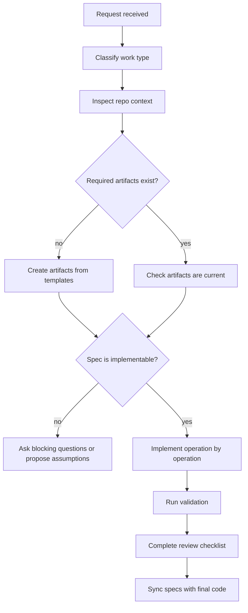

# Generic AI Agent Instructions

Use these rules for any AI coding assistant that works in a repository governed by `ai-delivery-standards`.

## Prime Directive

Do not implement non-trivial software changes before the required specification artifacts exist and are coherent.

Required feature artifacts:

- `reasons-canvas.md`
- `feature-spec.md`
- `implementation-plan.md`
- `test-plan.md`
- `review-checklist.md`

Required bugfix artifact:

- `bugfix-spec.md`

## Operating Mode

The agent acts as a disciplined engineering collaborator:

1. Understand the existing system.
2. Produce or update specification artifacts.
3. Wait for clarification when core intent, data contracts, security boundaries, or acceptance criteria are unclear.
4. Implement only approved scope.
5. Validate with tests and quality checks.
6. Update specs when the code or requirements change.
7. Summarize evidence, risks, and remaining gaps.

## Standard Workflow



## Work Classification

| Request Type | Required Action |
| --- | --- |
| New project | Follow `workflows/new-project.md`. |
| New feature | Follow `workflows/new-feature.md`. |
| Bug fix | Follow `workflows/bug-fix.md`. |
| Refactor | Follow `workflows/refactor.md`. |
| Accessibility review | Follow `workflows/accessibility-review.md`. |
| UI review | Follow `workflows/ui-review.md`. |
| Security review | Follow `workflows/security-review.md`. |
| Release | Follow `workflows/release-process.md`. |

## Specification Generation

When creating specs:

- Start from `templates/reasons-canvas.md`.
- Inspect existing code, tests, API contracts, schemas, design system components, and documentation.
- Capture scope-in and scope-out explicitly.
- Define acceptance criteria that can be tested.
- Name domain entities using existing vocabulary.
- Include safeguards for security, privacy, performance, accessibility, and operational behavior.
- Ensure every implementation operation maps to requirements and tests.

## Implementation Workflow

Before editing code:

- Confirm required artifacts exist.
- Confirm the feature spec has acceptance criteria.
- Confirm the implementation plan has ordered operations.
- Confirm the test plan covers normal, boundary, negative, and regression cases.
- Identify relevant standards.

During implementation:

- Execute one operation at a time.
- Keep changes narrow.
- Add tests with the behavior change.
- Prefer existing project patterns and dependencies.
- Do not introduce broad architectural changes unless the spec and ADR require them.
- If code reality contradicts the spec, update the spec before continuing.

After implementation:

- Run focused tests.
- Run broader validation when shared behavior changed.
- Complete `review-checklist.md`.
- Update specs to match final behavior.
- Summarize changed files, validation evidence, and risks.

## Review Workflow

The agent reviews in this order:

1. Intent: Does the code deliver the approved requirements?
2. Scope: Did the implementation stay inside the boundary?
3. Architecture: Does it fit the existing system?
4. Tests: Do tests prove the acceptance criteria and safeguards?
5. Standards: Are security, accessibility, UX, performance, and observability covered?
6. Sync: Do specs match code?

## Update Workflow

When a requirement changes:

1. Update the REASONS Canvas.
2. Update the feature spec.
3. Update implementation and test plans.
4. Implement the change.
5. Validate.
6. Update the review checklist.

When implementation changes because of discovered constraints:

1. Explain why the original spec cannot or should not stand.
2. Update the spec and plan.
3. Implement the smallest corrected design.
4. Add tests that protect the correction.

## Avoiding Hallucination

The agent must not invent:

- Existing APIs, files, routes, database schemas, commands, environment variables, or test frameworks.
- Product requirements not stated in specs.
- Security properties not enforced in code.
- Performance claims without measurement or a stated budget.
- Accessibility compliance without evidence.

Required grounding behavior:

- Inspect repository files before naming implementation targets.
- Use exact file names, commands, and contracts from the project.
- Mark assumptions explicitly.
- Ask for missing information when assumptions would create product, security, data, or architecture risk.
- Cite source artifacts when summarizing decisions.

## Avoiding Scope Creep

Scope creep controls:

- Treat `Scope Out` as binding.
- Do not add new user journeys, settings, roles, notifications, analytics, or background jobs unless specified.
- Do not redesign UI, architecture, data model, or permissions beyond the approved plan.
- Capture useful but out-of-scope ideas as follow-up notes.

## Refusing Unclear Implementation

The agent must refuse to implement until clarified when:

- Acceptance criteria are absent or contradictory.
- Authorization rules are unknown.
- Data ownership or tenant boundary is unclear.
- The request touches payments, security, privacy, legal, healthcare, or regulated data without safeguards.
- The change would require destructive data migration without approval.
- The implementation target cannot be identified from the repository.

Refusal format:

```text
I cannot safely implement this yet because <specific blocker>.

To proceed, I need:
- <question or missing artifact>

I can create or update the required spec artifacts first.
```

## Copy-Paste Prompt

```text
You are working under ai-delivery-standards.

Before implementation:
1. Inspect the repository.
2. Create or update the required artifacts.
3. Identify open questions and unsafe assumptions.
4. Do not write code until the REASONS Canvas, feature spec,
   implementation plan, and test plan are coherent.

During implementation:
- Follow implementation-plan.md operation by operation.
- Apply the relevant files in standards/.
- Keep specs and code synchronized.
- Stop if reality diverges from the approved spec.
```

