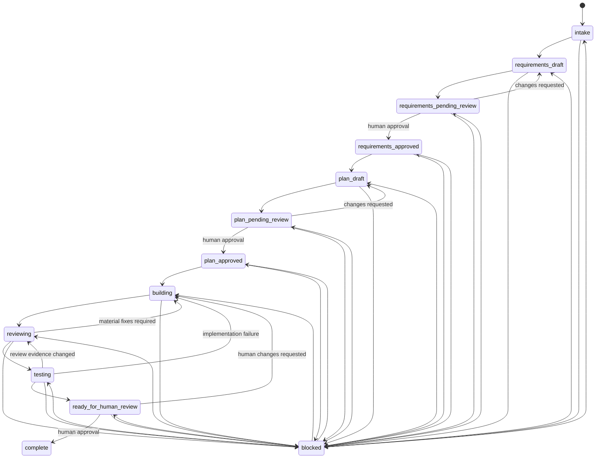

# Agent State Machine

Status: Proposal

Current implementation note: approval gates are configurable through `.ai/config.json` `approvalPolicy`. This proposal's human-approval language describes the default `human_required` policy; a project may set any gate to `not_required` to allow automated advancement after required artifacts and evidence exist.

This proposal defines the universal feature lifecycle state machine for V2. It is the authoritative contract for what an AI agent may do at any point in a feature's life.

## Objective

Every feature must move through the same lifecycle:

```text
intake
-> requirements_draft
-> requirements_pending_review
-> requirements_approved
-> plan_draft
-> plan_pending_review
-> plan_approved
-> building
-> reviewing
-> testing
-> ready_for_human_review
-> complete
```

The feature may enter `blocked` from any non-terminal state when progress requires human input or an external condition.

No agent may skip approval gates.

## State Definitions

| State | Owner Role | Meaning | Agent May Do | Agent Must Not Do |
| --- | --- | --- | --- | --- |
| `intake` | Requirements Agent | An idea exists but requirements are not yet shaped. | Clarify intent, create feature folder, capture problem and scope. | Plan implementation or edit production code. |
| `requirements_draft` | Requirements Agent | Requirements are being drafted. | Write `requirements.md`, inspect product context, identify questions. | Create implementation plan beyond high-level approach, build code. |
| `requirements_pending_review` | Requirements Agent | Requirements are ready for human review. | Summarize requirements, wait for approval or changes. | Self-approve, plan, or build. |
| `requirements_approved` | Planner Agent | Human has approved requirements. | Start planning. | Change approved requirements without returning to draft. |
| `plan_draft` | Planner Agent | Implementation and test approach are being drafted. | Write `plan.md`, refine `tests.md`, map operations to acceptance criteria. | Build production code. |
| `plan_pending_review` | Planner Agent | Plan is ready for human review. | Summarize plan, wait for approval or changes. | Self-approve or build. |
| `plan_approved` | Builder Agent | Human has approved the plan. | Start implementation. | Expand scope beyond approved plan. |
| `building` | Builder Agent | Approved implementation is in progress. | Edit production code, update tests as planned, record deviations. | Change requirements or plan scope without returning to the appropriate draft state. |
| `reviewing` | Reviewer Agent | Implementation is ready for AI review. | Review diff against requirements, plan, standards, and tests. | Add unplanned features or approve as human. |
| `testing` | Tester Agent | Reviewed implementation is ready for validation. | Run tests, add planned test coverage, record evidence. | Change production behavior except through a return to `building`. |
| `ready_for_human_review` | Sync Agent | AI work is complete enough for human review. | Sync artifacts, summarize evidence, wait for final human approval. | Mark complete without human implementation approval. |
| `complete` | None | Feature is complete. | Read and reference artifacts. | Continue modifying the feature without a new lifecycle entry. |
| `blocked` | Current or Sync Agent | Progress is blocked. | Record blocker, ask for needed input, resume when resolved. | Invent decisions or bypass missing approvals. |

## State Diagram



`blocked` must record `resumeState`. Resuming from `blocked` is allowed only to the recorded state or to an earlier safer state.

## Allowed Transitions

| From | To | Trigger | Required Actor | Required Evidence |
| --- | --- | --- | --- | --- |
| none | `intake` | `/start-feature` | Human or Requirements Agent | Feature ID, title, initial intent. |
| `intake` | `requirements_draft` | Requirements work begins | Requirements Agent | Feature folder and `state.json`. |
| `requirements_draft` | `requirements_pending_review` | Requirements draft complete | Requirements Agent | `requirements.md` complete enough for review. |
| `requirements_pending_review` | `requirements_draft` | Changes requested | Human or Requirements Agent | Review notes or unresolved questions. |
| `requirements_pending_review` | `requirements_approved` | `/approve-requirements` | Human | Requirements approval recorded in `approval.md`. |
| `requirements_approved` | `plan_draft` | Planning begins | Planner Agent | Requirements approval exists. |
| `plan_draft` | `plan_pending_review` | Plan draft complete | Planner Agent | `plan.md` and `tests.md` drafted. |
| `plan_pending_review` | `plan_draft` | Changes requested | Human or Planner Agent | Review notes or plan gaps. |
| `plan_pending_review` | `plan_approved` | `/approve-plan` | Human | Plan approval recorded in `approval.md`. |
| `plan_approved` | `building` | `/build` | Builder Agent | Requirements and plan approvals exist. |
| `building` | `reviewing` | Build complete | Builder Agent | Code changes, tests updated, plan operation status updated. |
| `reviewing` | `building` | Review finds material defects | Reviewer Agent | Findings in `review.md`. |
| `reviewing` | `testing` | Review passes or non-blocking findings only | Reviewer Agent | Review evidence in `review.md`. |
| `testing` | `building` | Tests fail due to implementation defect | Tester Agent | Failure evidence in `tests.md`. |
| `testing` | `reviewing` | Test evidence changes review risk | Tester Agent | Validation evidence and reason. |
| `testing` | `ready_for_human_review` | Tests complete | Tester Agent or Sync Agent | Validation evidence in `tests.md`. |
| `ready_for_human_review` | `building` | Human requests implementation changes | Human | Change request recorded. |
| `ready_for_human_review` | `complete` | `/complete` | Human | Implementation approval recorded in `approval.md`. |
| any non-terminal | `blocked` | Blocker encountered | Any role | Blocker reason, owner, needed decision, resume state. |
| `blocked` | recorded resume state | `/continue` or `/unblock` | Human or current role | Blocker resolved or safe assumption recorded. |

## Forbidden Transitions

These transitions are always forbidden:

- `intake` -> `plan_draft`
- `intake` -> `building`
- `requirements_draft` -> `plan_draft`
- `requirements_draft` -> `building`
- `requirements_pending_review` -> `plan_draft` without human approval
- `requirements_pending_review` -> `building`
- `requirements_approved` -> `building`
- `plan_draft` -> `building`
- `plan_pending_review` -> `building` without human approval
- `plan_approved` -> `complete`
- `building` -> `testing` without `reviewing`
- `building` -> `ready_for_human_review`
- `reviewing` -> `complete`
- `testing` -> `complete`
- `ready_for_human_review` -> `complete` without human implementation approval
- `complete` -> any implementation state for the same feature

The only valid way to change a completed feature is to create a new feature, amendment, bug fix, or refactor lifecycle entry that references the completed feature.

## Approval Requirements

### Requirements Approval

Required transition:

```text
requirements_pending_review -> requirements_approved
```

Required evidence:

- `requirements.md` is complete.
- `approval.md` contains a human approval entry for requirements.
- `state.json.approvals.requirements.status` is `approved`.

### Plan Approval

Required transition:

```text
plan_pending_review -> plan_approved
```

Required evidence:

- `plan.md` contains ordered operations.
- `tests.md` maps acceptance criteria to validation.
- `approval.md` contains a human approval entry for plan.
- `state.json.approvals.plan.status` is `approved`.

### Implementation Approval

Required transition:

```text
ready_for_human_review -> complete
```

Required evidence:

- `review.md` contains review findings and resolution.
- `tests.md` contains validation evidence.
- `approval.md` contains a human approval entry for implementation.
- `state.json.approvals.implementation.status` is `approved`.

## Human Approval Definition

Human approval means an explicit approval from a human stakeholder in chat, issue, PR comment, ticket, commit, or another durable system referenced by `approval.md`.

An AI agent may record a human approval after it is given, but it must not invent, infer, or self-grant approval.

## `state.json` Conceptual Shape

```json
{
  "featureId": "FEA-001",
  "title": "Example Feature",
  "state": "plan_approved",
  "previousState": "plan_pending_review",
  "resumeState": null,
  "activeRole": "Builder Agent",
  "createdAt": "2026-06-22T00:00:00Z",
  "updatedAt": "2026-06-22T00:00:00Z",
  "artifacts": {
    "requirements": "requirements.md",
    "plan": "plan.md",
    "tests": "tests.md",
    "review": "review.md",
    "approval": "approval.md"
  },
  "approvals": {
    "requirements": {
      "status": "approved",
      "approvedBy": "human",
      "approvedAt": "2026-06-22T00:00:00Z",
      "source": "chat"
    },
    "plan": {
      "status": "approved",
      "approvedBy": "human",
      "approvedAt": "2026-06-22T00:00:00Z",
      "source": "chat"
    },
    "implementation": {
      "status": "pending"
    }
  },
  "lastTransition": {
    "from": "plan_pending_review",
    "to": "plan_approved",
    "by": "human",
    "at": "2026-06-22T00:00:00Z",
    "command": "/approve-plan"
  },
  "blockers": [],
  "reviewCycles": {
    "count": 0,
    "limit": 2
  }
}
```

## Agent Enforcement Rules

Before acting, every agent must:

1. Read `AGENTS.md`.
2. Read `.ai/config.json`.
3. Identify the active feature from `.ai/registry.json` or the user's command.
4. Read `.ai/features/<ID>/state.json`.
5. Confirm its role is allowed in the current state.
6. Confirm required approvals exist for the action requested.
7. Refuse or transition to `blocked` when the state does not allow the requested action.

## Completion Criteria

The state machine is ready for implementation when:

- Every command in the universal command protocol maps to a transition or read-only operation.
- Every role has allowed states and prohibited behavior.
- Every approval gate has durable evidence requirements.
- Legacy V1 artifacts can be mapped into a valid state without losing information.
