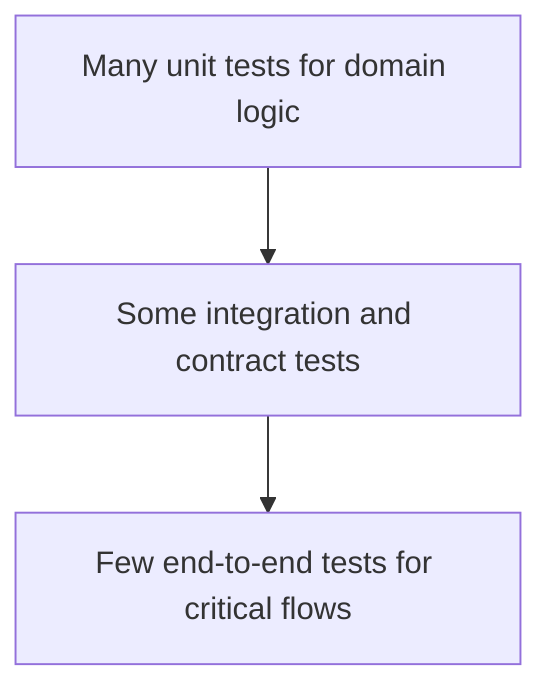

# Testing Standards

Tests prove that the implementation satisfies the spec and protects future change. AI-generated code must not rely on manual inspection alone.

## Testing Principles

- Test behavior, not implementation details.
- Map tests to acceptance criteria and safeguards.
- Prefer fast, focused tests for domain logic.
- Use integration or contract tests for boundaries.
- Add regression tests for every confirmed bug.
- Keep tests deterministic and independent.

## Test Pyramid

## Required Coverage By Change Type

| Change Type | Minimum Tests |
| --- | --- |
| Domain logic | Unit tests for normal, boundary, and failure cases. |
| API | Contract tests for request, response, validation, and authorization. |
| UI component | Component tests for states, interactions, and accessibility names. |
| Critical user flow | End-to-end test or documented manual validation. |
| Bug fix | Regression test that fails before the fix. |
| Security control | Negative tests for denied access or rejected input. |
| AI feature | Scenario evaluations for grounded, refusal, ambiguous, and adversarial prompts. |

## Acceptance Criteria Traceability

Every acceptance criterion in `feature-spec.md` should map to:

- At least one automated test, or
- A manual validation note with reason automation is not practical.

Use this shape:

| Acceptance Criterion | Test | Level |
| --- | --- | --- |
| `<AC>` | `<test name>` | `<unit/integration/e2e/manual>` |

## Test Data

- Use factories or fixtures that make intent clear.
- Avoid global shared state.
- Avoid real secrets, production data, or uncontrolled external calls.
- Include boundary data: empty, maximum length, invalid format, missing field, duplicate, unauthorized, expired.

## API Testing

API tests should cover:

- Successful request.
- Missing required fields.
- Invalid field values.
- Unauthorized request.
- Forbidden request.
- Not found behavior.
- Conflict or duplicate behavior.
- Rate limit or abuse behavior where applicable.
- Response shape and error shape.

## UI Testing

UI tests should cover:

- Rendering of key states.
- User interaction through accessible queries.
- Form validation and recovery.
- Keyboard interaction where practical.
- Loading and error handling.
- Important responsive or layout behavior if tooling supports it.

## AI Feature Testing

AI features require evaluation cases:

| Category | What To Test |
| --- | --- |
| In-domain | Answers correctly using approved context. |
| Out-of-domain | Refuses unrelated requests. |
| No evidence | Says it does not know or asks for clarification. |
| Prompt injection | Ignores instructions that conflict with system boundaries. |
| Structured output | Always conforms to required schema. |
| Safety/privacy | Does not reveal secrets, hidden prompts, or restricted data. |

Prefer deterministic seams:

- Mock retrieval results.
- Stub model responses where possible.
- Validate prompts, tool calls, classifiers, and output parsers separately.
- Use golden cases for end-to-end AI behavior.

## Flaky Tests

Flaky tests are defects.

If a test flakes:

- Identify the cause.
- Remove time, network, ordering, randomness, or shared-state instability.
- Do not loosen assertions until they stop proving the behavior.
- Quarantine only with owner, expiry, and ticket.

## Test Review Questions

- Would the test fail if the requirement were broken?
- Does it cover the highest-risk behavior?
- Is it deterministic?
- Is it readable as executable documentation?
- Does it avoid overspecifying implementation details?

## Done Means

- Required validation commands pass.
- Known gaps are recorded in `test-plan.md`.
- Critical safeguards have negative tests.
- Test names and assertions communicate user or domain behavior.

