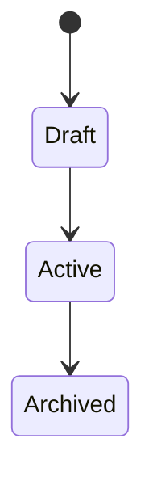
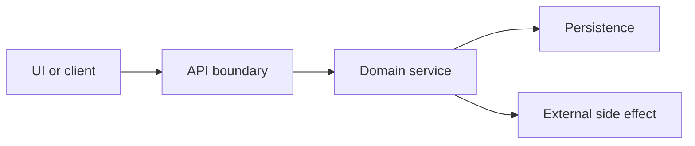

# REASONS Canvas Template

Use this template before implementation. The REASONS Canvas turns intent into a governed execution plan for AI-assisted development.

```yaml
artifact: reasons-canvas
feature_id: FEA-000
feature_name: ""
owner: ""
status: draft
created: YYYY-MM-DD
updated: YYYY-MM-DD
related_artifacts:
  feature_spec: feature-spec.md
  implementation_plan: implementation-plan.md
  test_plan: test-plan.md
```

## Summary

State the feature in one paragraph. Include the user problem, business value, and implementation boundary.

Example:

> Enable administrators to invite users by email from the team settings page. The feature covers invite creation, validation, email dispatch, and audit logging. It does not cover role redesign, billing changes, or bulk import.

## R - Requirements

### Purpose

Define the problem, user outcomes, acceptance criteria, and definition of done. This section must describe what success means without prematurely prescribing code.

### Questions

- Who is the user or system actor?
- What problem are they trying to solve?
- What must be true when the work is complete?
- What acceptance criteria can be tested end to end?
- What is explicitly out of scope?
- What existing behavior must not regress?
- What data, legal, compliance, or operational constraints apply?

### Implementation Guidance

- Write acceptance criteria in observable language.
- Prefer Given/When/Then for user-facing behavior and request/response examples for APIs.
- Include negative cases and boundary conditions.
- Define scope out as aggressively as scope in.
- If requirements are unclear, the agent must stop and ask for clarification before implementation.

### Content

#### Problem Statement

`<Describe the problem in business and user terms.>`

#### Users And Actors

| Actor | Goal | Permissions Or Constraints |
| --- | --- | --- |
| `<actor>` | `<goal>` | `<constraints>` |

#### Scope In

- `<included behavior>`

#### Scope Out

- `<excluded behavior>`

#### Acceptance Criteria

1. Given `<context>`, when `<action>`, then `<observable result>`.
2. Given `<invalid or boundary context>`, when `<action>`, then `<safe result>`.

#### Definition Of Done

- [ ] Acceptance criteria are implemented and tested.
- [ ] Required artifacts are updated.
- [ ] Accessibility, security, observability, and testing standards are satisfied.
- [ ] Specs match final code behavior.

### Example

```text
Given a team administrator enters a valid email address for a non-member
When they submit the invite form
Then the system creates a pending invitation, sends one email, and records an audit event.
```

## E - Entities

### Purpose

Identify the domain entities, data relationships, state transitions, and vocabulary the agent must preserve.

### Questions

- What are the core domain nouns?
- Which entities already exist in the codebase?
- What new entities or value objects are needed?
- What relationships, ownership boundaries, or lifecycle states matter?
- Which fields are sensitive, derived, immutable, or externally controlled?
- What terms must the implementation use consistently?

### Implementation Guidance

- Reuse existing domain language from the product.
- Distinguish domain entities from transport DTOs and persistence records.
- Include state machines when lifecycle matters.
- Document identifiers, uniqueness rules, and authorization ownership.
- Avoid inventing new names when established names exist.

### Content

#### Domain Vocabulary

| Term | Meaning | Source |
| --- | --- | --- |
| `<term>` | `<definition>` | `<code/doc/business source>` |

#### Entity Model

| Entity | Responsibilities | Key Fields | Relationships |
| --- | --- | --- | --- |
| `<entity>` | `<responsibilities>` | `<fields>` | `<relationships>` |

#### State Transitions



### Example

| Entity | Responsibilities | Key Fields | Relationships |
| --- | --- | --- | --- |
| Invitation | Represents a pending team invite | id, email, teamId, role, expiresAt, status | Belongs to Team; created by User |

## A - Approach

### Purpose

Explain the solution strategy and trade-offs. This is where the team chooses how to meet the requirements before the agent writes code.

### Questions

- What strategy best fits the existing architecture?
- Which alternatives were considered and rejected?
- What can be implemented incrementally?
- What must be configurable?
- What should be reusable across future features?
- What risks need design mitigations?

### Implementation Guidance

- Choose the smallest design that satisfies current requirements and likely near-term change.
- Prefer existing patterns over new abstractions.
- Document rejected alternatives when the choice is not obvious.
- Include migration, rollout, and rollback considerations.
- Call out any AI-specific constraints such as grounding, refusal, tool access, or structured outputs.

### Content

#### Selected Strategy

`<Describe the chosen approach.>`

#### Alternatives Considered

| Alternative | Why Not |
| --- | --- |
| `<alternative>` | `<reason rejected>` |

#### Key Design Decisions

- `<decision and rationale>`

#### Risks And Mitigations

| Risk | Mitigation |
| --- | --- |
| `<risk>` | `<mitigation>` |

### Example

```text
Use the existing notification service for invite email dispatch instead of adding
a direct SMTP integration. This preserves retry behavior, audit correlation, and
provider abstraction already used by password reset emails.
```

## S - Structure

### Purpose

Map the change into the system. Identify components, files, boundaries, dependencies, interfaces, and ownership.

### Questions

- Which packages, services, pages, components, routes, jobs, or schemas change?
- What interfaces or contracts are introduced or modified?
- What dependencies are added, removed, or reused?
- Which components own validation, authorization, persistence, and side effects?
- What migration or compatibility concerns exist?

### Implementation Guidance

- Provide concrete file/module targets after inspecting the repository.
- Keep ownership boundaries clear.
- Avoid cross-layer shortcuts.
- Define API contracts before implementation.
- Include diagrams for non-trivial flows.

### Content

#### Impacted Areas

| Area | Change | Owner |
| --- | --- | --- |
| `<module>` | `<change>` | `<owner/team>` |

#### Proposed Component Flow



#### Contracts

```json
{
  "request": {},
  "response": {},
  "errors": []
}
```

### Example

| Area | Change | Owner |
| --- | --- | --- |
| `TeamSettingsPage` | Add invite form and status handling | Frontend |
| `POST /api/teams/:teamId/invitations` | Create invite endpoint | Backend |
| `InvitationService` | Validate, persist, notify, audit | Platform |

## O - Operations

### Purpose

Break the approach into concrete, ordered, testable implementation steps. Agents execute this section one operation at a time.

### Questions

- What is the smallest safe sequence of changes?
- Which tests should be written or updated with each operation?
- What can be validated independently?
- What data migrations or config changes are required?
- What rollback path exists?

### Implementation Guidance

- Each operation should have a clear input, output, files/modules, and validation step.
- Keep operations small enough for focused review.
- Include test operations, not just production code operations.
- The agent must not implement operations that are absent from the approved plan.

### Content

| Step | Operation | Files Or Modules | Validation |
| --- | --- | --- | --- |
| 1 | `<operation>` | `<targets>` | `<test/check>` |
| 2 | `<operation>` | `<targets>` | `<test/check>` |

### Example

| Step | Operation | Files Or Modules | Validation |
| --- | --- | --- | --- |
| 1 | Add `Invitation` schema and repository methods | `db/schema`, `InvitationRepository` | Repository unit tests |
| 2 | Add invitation service with validation and audit | `InvitationService` | Service unit tests for success and failure |
| 3 | Add API route | `POST /api/teams/:teamId/invitations` | API contract tests |
| 4 | Add invite form UI | `TeamSettingsPage` | Component and accessibility tests |

## N - Norms

### Purpose

Declare the engineering conventions the agent must follow while implementing the feature.

### Questions

- Which coding, naming, architecture, testing, and UX standards apply?
- What existing local conventions must be preserved?
- What logging, metrics, tracing, and error handling patterns are required?
- What accessibility standards apply?
- What dependency rules apply?

### Implementation Guidance

- Reference repository standards directly.
- Include feature-specific norms only when global standards are insufficient.
- Make norms measurable where possible.
- Treat norms as review criteria, not suggestions.

### Content

Required standards:

- `standards/engineering.md`
- `standards/ai-model-routing.md`
- `standards/testing.md`
- `standards/security.md`
- `standards/accessibility.md`
- `<additional standard>`

Feature-specific norms:

- `<norm>`

### Example

```text
Use existing `Result<T, DomainError>` error handling in domain services.
Never throw raw strings. API errors must use the established problem-details shape.
```

## S - Safeguards

### Purpose

Define non-negotiable boundaries, invariants, security requirements, performance limits, and refusal conditions.

### Questions

- What must never happen?
- What inputs must be rejected?
- What data must not be exposed?
- What authorization checks are mandatory?
- What rate limits, quotas, or performance budgets apply?
- What fallback or failure behavior is required?
- When must the AI agent stop rather than proceed?

### Implementation Guidance

- Write safeguards as enforceable constraints.
- Include tests for critical safeguards.
- Use explicit refusal rules for AI-facing features.
- Define safe degradation behavior.
- If a safeguard cannot be implemented, the feature is not complete.

### Content

| Safeguard | Enforcement | Test Evidence |
| --- | --- | --- |
| `<constraint>` | `<where/how enforced>` | `<test>` |

### Example

| Safeguard | Enforcement | Test Evidence |
| --- | --- | --- |
| Non-admins cannot create invitations | API authorization middleware and service guard | API returns 403 for member role |
| Invitation email is never logged | Redacted logging helper | Unit test asserts log payload excludes email |

## Open Questions

| Question | Owner | Needed By | Resolution |
| --- | --- | --- | --- |
| `<question>` | `<owner>` | `<date/stage>` | `<answer>` |

## Approval

- Product approval:
- Engineering approval:
- Security approval, if required:
- Accessibility approval, if required:
